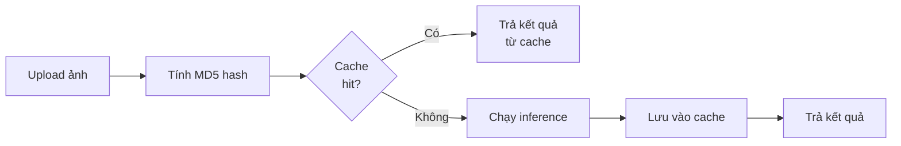
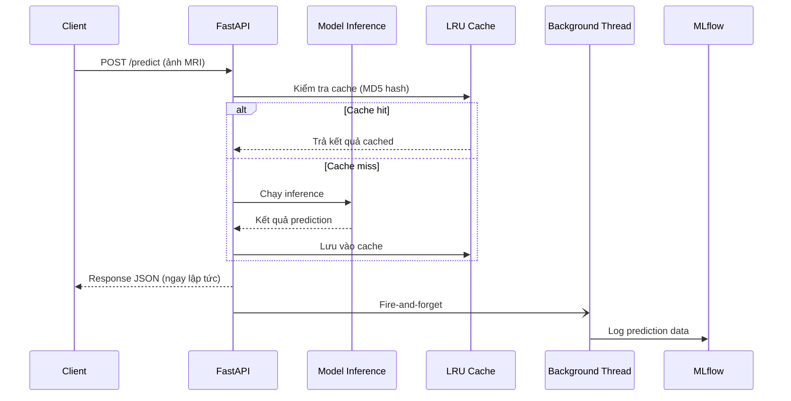

# 📖 API Reference — Brain Tumor Detection

> [!NOTE]
> Tài liệu tham chiếu đầy đủ cho **FastAPI backend** phát hiện khối u não.
> Swagger UI tự động được tạo tại endpoint `/docs`.

---

## Mục lục

- [Base URL](#base-url)
- [Tổng quan Endpoints](#tổng-quan-endpoints)
- [Chi tiết Endpoints](#chi-tiết-endpoints)
  - [GET /](#get-)
  - [GET /health](#get-health)
  - [GET /metrics](#get-metrics)
  - [GET /model-info](#get-model-info)
  - [POST /predict](#post-predict)
  - [GET /mlflow-dashboard](#get-mlflow-dashboard)
- [Ví dụ với curl](#ví-dụ-với-curl)
- [Ví dụ với Python requests](#ví-dụ-với-python-requests)
- [Xử lý lỗi (Error Handling)](#xử-lý-lỗi-error-handling)
- [CORS](#cors)
- [Prediction Cache](#prediction-cache)
- [Async MLflow Logging](#async-mlflow-logging)

---

## Base URL

| Môi trường | URL                      |
| ---------- | ------------------------ |
| Local      | `http://localhost:8000`  |
| Docker     | `http://localhost:8000`  |

> [!TIP]
> Truy cập **Swagger UI** tại `http://localhost:8000/docs` để tương tác trực tiếp với API
> và xem schema chi tiết cho từng endpoint.

---

## Tổng quan Endpoints

| Method   | Endpoint            | Mô tả                                          |
| -------- | ------------------- | ----------------------------------------------- |
| `GET`    | `/`                 | Kiểm tra trạng thái hoạt động của API           |
| `GET`    | `/health`           | Health check cho load balancer và monitoring     |
| `GET`    | `/metrics`          | Thống kê prediction (cache, inference time, …)  |
| `GET`    | `/model-info`       | Thông tin model đang được sử dụng               |
| `POST`   | `/predict`          | **Endpoint chính** — upload ảnh MRI để phát hiện khối u |
| `GET`    | `/mlflow-dashboard` | Thông tin truy cập MLflow UI                    |

---

## Chi tiết Endpoints

### GET `/`

**Mô tả:** Root endpoint — trả về trạng thái hoạt động và phiên bản hiện tại của API.

**Response** `200 OK`

```json
{
  "message": "Brain Tumor Detection API is running",
  "version": "2.0.0",
  "docs_url": "/docs"
}
```

| Trường      | Kiểu     | Mô tả                                   |
| ----------- | -------- | ---------------------------------------- |
| `message`   | `string` | Thông báo trạng thái API                 |
| `version`   | `string` | Phiên bản hiện tại của API               |
| `docs_url`  | `string` | Đường dẫn tới Swagger UI documentation   |

---

### GET `/health`

**Mô tả:** Health check endpoint — được thiết kế cho **load balancer** và hệ thống **monitoring** để kiểm tra tình trạng hoạt động của service.

**Response** `200 OK`

```json
{
  "status": "healthy",
  "timestamp": "2026-06-23T15:17:48.000000",
  "model_loaded": true,
  "model_source": "Registry/@production",
  "model_type": "PyFunc",
  "is_pyfunc": true,
  "gpu_available": true,
  "gpu_name": "NVIDIA GeForce RTX 3090"
}
```

| Trường           | Kiểu      | Mô tả                                                        |
| ---------------- | --------- | ------------------------------------------------------------- |
| `status`         | `string`  | Trạng thái service — luôn là `"healthy"` khi API hoạt động    |
| `timestamp`      | `string`  | Thời điểm kiểm tra, định dạng ISO 8601                       |
| `model_loaded`   | `boolean` | `true` nếu model đã được load thành công                     |
| `model_source`   | `string`  | Nguồn model (ví dụ: `"Registry/@production"`)                |
| `model_type`     | `string`  | Loại model (ví dụ: `"PyFunc"`, `"PyTorch"`)                  |
| `is_pyfunc`      | `boolean` | `true` nếu model được wrap dưới dạng MLflow PyFunc            |
| `gpu_available`  | `boolean` | `true` nếu GPU khả dụng cho inference                        |
| `gpu_name`       | `string \| null` | Tên GPU đang sử dụng, hoặc `null` nếu không có GPU   |

> [!IMPORTANT]
> Endpoint này **không yêu cầu authentication** và nên được cấu hình trong
> health check của Docker, Kubernetes liveness/readiness probe, hoặc load balancer
> để tự động phát hiện khi service gặp sự cố.

---

### GET `/metrics`

**Mô tả:** Trả về thống kê prediction từ `PredictionService`, bao gồm thông tin cache và thời gian inference trung bình.

**Response** `200 OK`

```json
{
  "total_predictions": 1250,
  "cache_size": 42,
  "cache_hits": 380,
  "cache_misses": 870,
  "cache_hit_rate": 0.304,
  "avg_inference_time": 0.045
}
```

| Trường               | Kiểu             | Mô tả                                                    |
| -------------------- | ---------------- | --------------------------------------------------------- |
| `total_predictions`  | `int`            | Tổng số lượt prediction đã thực hiện                     |
| `cache_size`         | `int`            | Số entry hiện có trong prediction cache                   |
| `cache_hits`         | `int`            | Số lần prediction được trả về từ cache                    |
| `cache_misses`       | `int`            | Số lần prediction phải chạy inference thực tế             |
| `cache_hit_rate`     | `float`          | Tỷ lệ cache hit (từ `0.0` đến `1.0`)                    |
| `avg_inference_time` | `float \| null`  | Thời gian inference trung bình (giây), `null` nếu chưa có prediction |

---

### GET `/model-info`

**Mô tả:** Trả về thông tin chi tiết về model đang được sử dụng cho prediction.

**Response** `200 OK`

```json
{
  "model_source": "Registry/@production",
  "model_type": "PyFunc",
  "is_pyfunc": true,
  "onnx_available": false
}
```

| Trường           | Kiểu      | Mô tả                                                             |
| ---------------- | --------- | ------------------------------------------------------------------ |
| `model_source`   | `string`  | Nguồn model — một trong các giá trị bên dưới                      |
| `model_type`     | `string`  | Loại model: `"PyFunc"` hoặc `"PyTorch"`                           |
| `is_pyfunc`      | `boolean` | `true` nếu model được wrap dưới dạng MLflow PyFunc                |
| `onnx_available` | `boolean` | `true` nếu ONNX Runtime backend khả dụng                         |

**Các giá trị có thể của `model_source`:**

| Giá trị                | Mô tả                                                        |
| ---------------------- | ------------------------------------------------------------- |
| `Registry/@production` | Model từ MLflow Model Registry với alias `@production`        |
| `Registry/v1`          | Model từ MLflow Model Registry với version cụ thể             |
| `Local/v1`             | Model được load từ file local                                 |
| `Default`              | Model mặc định (fallback khi không tìm thấy source nào khác) |

---

### POST `/predict`

**Mô tả:** **Endpoint chính** của API — upload ảnh MRI não để phát hiện và phân loại khối u. Hỗ trợ cả PyTorch và ONNX backend.

#### Request

**Content-Type:** `multipart/form-data`

| Parameter    | Kiểu         | Bắt buộc | Mặc định | Mô tả                                              |
| ------------ | ------------ | --------- | -------- | --------------------------------------------------- |
| `file`       | `UploadFile` | ✅ Có     | —        | File ảnh MRI (chỉ chấp nhận **JPEG** hoặc **PNG**) |
| `use_onnx`   | `bool`       | ❌ Không  | `false`  | Sử dụng ONNX Runtime backend cho inference          |
| `confidence` | `float`      | ❌ Không  | `0.5`   | Ngưỡng confidence (từ `0.0` đến `1.0`)              |

> [!WARNING]
> - Chỉ chấp nhận file **JPEG** (`.jpg`, `.jpeg`) và **PNG** (`.png`). Các định dạng khác sẽ trả về lỗi `400`.
> - Giá trị `confidence` ngoài phạm vi `0.0 – 1.0` có thể gây ra kết quả không mong muốn.

#### Response `200 OK`

```json
{
  "predictions": [
    {
      "class": "glioma",
      "confidence": 0.92,
      "bbox": [120.5, 80.3, 350.2, 290.1]
    }
  ],
  "processing_time": 0.045,
  "model_type": "Registry/@production",
  "model_framework": "PyTorch",
  "request_id": "a1b2c3d4-e5f6-7890-abcd-ef1234567890",
  "message": "Prediction completed successfully"
}
```

| Trường             | Kiểu              | Mô tả                                                      |
| ------------------ | ------------------ | ----------------------------------------------------------- |
| `predictions`      | `array<object>`    | Danh sách các detection (có thể rỗng nếu không phát hiện)  |
| `predictions[].class`      | `string`  | Loại khối u được phát hiện (ví dụ: `"glioma"`, `"meningioma"`, `"pituitary"`) |
| `predictions[].confidence` | `float`   | Độ tin cậy của prediction (`0.0` – `1.0`)                   |
| `predictions[].bbox`       | `array<float>` | Bounding box `[x_min, y_min, x_max, y_max]` (pixel)   |
| `processing_time`  | `float`            | Thời gian xử lý (giây)                                     |
| `model_type`       | `string`           | Nguồn model đã sử dụng                                     |
| `model_framework`  | `string`           | Framework inference (`"PyTorch"` hoặc `"ONNX"`)            |
| `request_id`       | `string`           | UUID duy nhất cho mỗi request (dùng để trace log)          |
| `message`          | `string`           | Thông báo kết quả                                           |

#### Error Responses

| HTTP Status | Nguyên nhân                                                   |
| ----------- | ------------------------------------------------------------- |
| `400`       | File không hợp lệ — sai định dạng (không phải JPEG/PNG) hoặc không thể decode ảnh |
| `500`       | Prediction thất bại — lỗi nội bộ trong quá trình inference    |

---

### GET `/mlflow-dashboard`

**Mô tả:** Trả về thông tin truy cập **MLflow UI** để theo dõi experiment, model version, và metric.

---

## Ví dụ với curl

### Kiểm tra trạng thái API

```bash
curl -X GET http://localhost:8000/
```

### Health check

```bash
curl -X GET http://localhost:8000/health
```

### Xem thống kê prediction

```bash
curl -X GET http://localhost:8000/metrics
```

### Xem thông tin model

```bash
curl -X GET http://localhost:8000/model-info
```

### Prediction với ảnh MRI (cơ bản)

```bash
curl -X POST http://localhost:8000/predict \
  -F "file=@/path/to/brain_mri.jpg"
```

### Prediction với ONNX backend và custom confidence threshold

```bash
curl -X POST http://localhost:8000/predict \
  -F "file=@/path/to/brain_mri.png" \
  -F "use_onnx=true" \
  -F "confidence=0.7"
```

### Prediction và lưu kết quả ra file JSON

```bash
curl -s -X POST http://localhost:8000/predict \
  -F "file=@/path/to/brain_mri.jpg" \
  | python -m json.tool > result.json
```

### Xem MLflow Dashboard info

```bash
curl -X GET http://localhost:8000/mlflow-dashboard
```

---

## Ví dụ với Python requests

### Kiểm tra trạng thái và health check

```python
import requests

BASE_URL = "http://localhost:8000"

# Kiểm tra trạng thái API
response = requests.get(f"{BASE_URL}/")
print(response.json())
# {'message': 'Brain Tumor Detection API is running', 'version': '2.0.0', 'docs_url': '/docs'}

# Health check
health = requests.get(f"{BASE_URL}/health")
print(health.json())
# {'status': 'healthy', 'model_loaded': True, 'gpu_available': True, ...}
```

### Xem metrics và model info

```python
import requests

BASE_URL = "http://localhost:8000"

# Thống kê prediction
metrics = requests.get(f"{BASE_URL}/metrics")
data = metrics.json()
print(f"Tổng predictions: {data['total_predictions']}")
print(f"Cache hit rate:    {data['cache_hit_rate']:.1%}")
print(f"Avg inference:     {data['avg_inference_time']:.3f}s")

# Thông tin model
model_info = requests.get(f"{BASE_URL}/model-info")
print(model_info.json())
```

### Prediction cơ bản

```python
import requests

BASE_URL = "http://localhost:8000"

# Upload ảnh MRI để phát hiện khối u
with open("brain_mri.jpg", "rb") as f:
    response = requests.post(
        f"{BASE_URL}/predict",
        files={"file": ("brain_mri.jpg", f, "image/jpeg")},
    )

result = response.json()
print(f"Request ID: {result['request_id']}")
print(f"Thời gian xử lý: {result['processing_time']:.3f}s")

for pred in result["predictions"]:
    print(f"  - {pred['class']}: {pred['confidence']:.2%} | bbox={pred['bbox']}")
```

### Prediction với tùy chọn nâng cao

```python
import requests

BASE_URL = "http://localhost:8000"

with open("brain_mri.png", "rb") as f:
    response = requests.post(
        f"{BASE_URL}/predict",
        files={"file": ("brain_mri.png", f, "image/png")},
        data={
            "use_onnx": "true",        # Sử dụng ONNX backend
            "confidence": "0.7",        # Ngưỡng confidence cao hơn
        },
    )

if response.status_code == 200:
    result = response.json()
    print(f"Framework: {result['model_framework']}")
    print(f"Detections: {len(result['predictions'])}")
else:
    print(f"Lỗi {response.status_code}: {response.json()['detail']}")
```

### Batch prediction trên nhiều ảnh

```python
import requests
from pathlib import Path

BASE_URL = "http://localhost:8000"
IMAGE_DIR = Path("./mri_images")

results = []

for image_path in IMAGE_DIR.glob("*.jpg"):
    with open(image_path, "rb") as f:
        response = requests.post(
            f"{BASE_URL}/predict",
            files={"file": (image_path.name, f, "image/jpeg")},
            data={"confidence": "0.5"},
        )

    if response.status_code == 200:
        data = response.json()
        results.append({
            "file": image_path.name,
            "detections": len(data["predictions"]),
            "processing_time": data["processing_time"],
            "predictions": data["predictions"],
        })
        print(f"✅ {image_path.name}: {len(data['predictions'])} detection(s)")
    else:
        print(f"❌ {image_path.name}: {response.status_code}")

print(f"\nĐã xử lý {len(results)}/{len(list(IMAGE_DIR.glob('*.jpg')))} ảnh thành công.")
```

---

## Xử lý lỗi (Error Handling)

Tất cả các lỗi được trả về theo chuẩn HTTP status code kèm theo thông báo chi tiết trong body JSON:

```json
{
  "detail": "Error description"
}
```

### Bảng mã lỗi thường gặp

| HTTP Status | Mô tả                        | Nguyên nhân phổ biến                                      |
| ----------- | ----------------------------- | --------------------------------------------------------- |
| `400`       | Bad Request                   | File upload không phải JPEG/PNG, hoặc ảnh bị hỏng không thể decode |
| `404`       | Not Found                     | Endpoint không tồn tại                                    |
| `405`       | Method Not Allowed            | Sử dụng sai HTTP method (ví dụ: GET thay vì POST cho `/predict`) |
| `422`       | Unprocessable Entity          | Thiếu parameter bắt buộc hoặc giá trị không hợp lệ (FastAPI validation) |
| `500`       | Internal Server Error         | Lỗi inference, model chưa load, hoặc lỗi hệ thống khác   |

### Ví dụ xử lý lỗi trong Python

```python
import requests

response = requests.post(
    "http://localhost:8000/predict",
    files={"file": ("test.txt", b"not an image", "text/plain")},
)

if response.status_code == 400:
    error = response.json()
    print(f"Lỗi: {error['detail']}")
    # Lỗi: Invalid file type. Only JPEG and PNG are supported.
elif response.status_code == 500:
    print("Lỗi server — vui lòng kiểm tra log hoặc thử lại sau.")
elif response.status_code == 200:
    print("Prediction thành công!")
```

---

## CORS

API sử dụng `CORSMiddleware` của FastAPI với cấu hình **cho phép tất cả origins**:

```python
from fastapi.middleware.cors import CORSMiddleware

app.add_middleware(
    CORSMiddleware,
    allow_origins=["*"],        # Cho phép mọi origin
    allow_credentials=True,
    allow_methods=["*"],        # Cho phép mọi HTTP method
    allow_headers=["*"],        # Cho phép mọi header
)
```

> [!CAUTION]
> Cấu hình `allow_origins=["*"]` **chỉ phù hợp cho môi trường development**.
> Trong **production**, nên giới hạn `allow_origins` theo danh sách domain cụ thể
> để tránh các rủi ro bảo mật liên quan đến Cross-Origin requests.

Điều này có nghĩa:
- Frontend chạy trên bất kỳ domain nào đều có thể gọi API.
- Không cần proxy hoặc cấu hình đặc biệt cho cross-origin requests trong quá trình phát triển.

---

## Prediction Cache

API triển khai cơ chế **LRU (Least Recently Used) caching** để tối ưu hiệu năng cho các prediction lặp lại.

### Cách hoạt động



### Chi tiết cấu hình

| Thuộc tính       | Giá trị                                                      |
| ---------------- | ------------------------------------------------------------- |
| **Thuật toán**   | LRU (Least Recently Used)                                     |
| **Cache size**   | 50 entries                                                    |
| **Cache key**    | MD5 hash kết hợp: nội dung ảnh + `confidence` + `use_onnx`   |
| **Scope**        | Per-process — không chia sẻ giữa các worker                   |

### Lưu ý quan trọng

> [!IMPORTANT]
> - Cache là **per-process**: mỗi worker (process) có cache riêng. Nếu chạy nhiều workers
>   (ví dụ: `uvicorn --workers 4`), mỗi worker sẽ có cache độc lập.
> - Cùng một ảnh nhưng khác `confidence` hoặc `use_onnx` sẽ tạo **cache key khác nhau**.
> - Khi cache đầy (50 entries), entry ít được sử dụng nhất sẽ bị loại bỏ tự động.
> - Theo dõi hiệu quả cache qua endpoint [`GET /metrics`](#get-metrics).

---

## Async MLflow Logging

Mỗi prediction sẽ được **tự động log vào MLflow** trong một background thread theo cơ chế **fire-and-forget** — không ảnh hưởng đến thời gian response trả về client.

### Dữ liệu được log

| Trường              | Kiểu     | Mô tả                                              |
| ------------------- | -------- | --------------------------------------------------- |
| `request_id`        | `string` | UUID duy nhất của request                           |
| `model_type`        | `string` | Nguồn model đã sử dụng                             |
| `model_framework`   | `string` | Framework inference (`"PyTorch"` hoặc `"ONNX"`)    |
| `filename`          | `string` | Tên file ảnh được upload                            |
| `processing_time`   | `float`  | Thời gian xử lý (giây)                             |
| `num_detections`    | `int`    | Số lượng detection trong ảnh                        |
| `avg_confidence`    | `float`  | Confidence trung bình của các detection             |
| `max_confidence`    | `float`  | Confidence cao nhất trong các detection             |

### Kiến trúc logging



> [!NOTE]
> - Logging chạy **bất đồng bộ** trong background thread — nếu MLflow server không khả dụng,
>   việc log sẽ thất bại âm thầm mà **không ảnh hưởng** đến prediction response.
> - Dữ liệu log có thể được xem và phân tích trên **MLflow UI** (xem endpoint
>   [`GET /mlflow-dashboard`](#get-mlflow-dashboard)).
