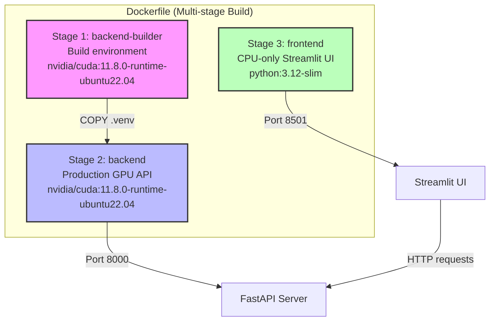
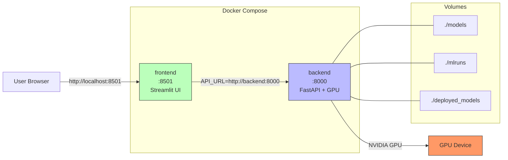

# Docker Deployment

Tài liệu hướng dẫn triển khai Docker cho dự án **Brain Tumor Detection**.

> [!NOTE]
> Dự án sử dụng **multi-stage Dockerfile** gồm 3 stages kết hợp với **Docker Compose** để orchestrate toàn bộ hệ thống. Backend chạy trên GPU với NVIDIA CUDA, frontend là ứng dụng Streamlit nhẹ chạy trên CPU.

---

## Mục Lục

- [Kiến Trúc Docker](#kiến-trúc-docker)
  - [Dockerfile Stages](#dockerfile-stages)
  - [Docker Compose](#docker-compose)
- [Hướng Dẫn Sử Dụng](#hướng-dẫn-sử-dụng)
- [.dockerignore](#dockerignore)
- [Tối Ưu Kích Thước Image](#tối-ưu-kích-thước-image)
- [GPU Support](#gpu-support)
- [Xử Lý Sự Cố](#xử-lý-sự-cố)

---

## Kiến Trúc Docker

Dự án sử dụng **multi-stage Dockerfile** gồm 3 stages và **Docker Compose** để orchestrate các services.



---

### Dockerfile Stages

#### Stage 1: `backend-builder` — Build Environment

> **Base image:** `nvidia/cuda:11.8.0-runtime-ubuntu22.04`
>
> **Mục đích:** Cài đặt Python 3.12, uv package manager, và tất cả dependencies. Stage này **KHÔNG** được giữ lại trong image cuối cùng (builder pattern).

**Các bước thực hiện:**

| Bước | Mô tả | Chi tiết |
|------|--------|----------|
| 1 | Cài đặt Python 3.12 | Từ **deadsnakes PPA** + `build-essential` |
| 2 | Copy `uv` | Từ `ghcr.io/astral-sh/uv:latest` |
| 3 | Copy dependency files | `pyproject.toml` + `uv.lock` |
| 4 | Cài đặt dependencies | `uv sync --frozen --no-dev` (chỉ production deps) |
| 5 | Dọn dẹp cache | Xóa `__pycache__`, `*.pyc`, `*.pyo` |

> [!IMPORTANT]
> Stage này sử dụng **builder pattern** — toàn bộ build tools và cache sẽ bị loại bỏ, chỉ có thư mục `.venv` được copy sang stage tiếp theo. Điều này giúp giảm đáng kể kích thước image cuối cùng.

---

#### Stage 2: `backend` — Production GPU API

> **Base image:** `nvidia/cuda:11.8.0-runtime-ubuntu22.04`
>
> **Mục đích:** Server API production với hỗ trợ GPU cho inference model.

**Các bước thực hiện:**

| Bước | Mô tả | Chi tiết |
|------|--------|----------|
| 1 | Cài đặt runtime | Python 3.12 + `libgl1` + `libglib2.0-0` (cho OpenCV) |
| 2 | Thiết lập Python mặc định | Sử dụng `update-alternatives` cho Python 3.12 |
| 3 | Tạo symlink Windows path | `/D:/Workspaces/Mlops_Brain_Turmo` → `/app` |
| 4 | Copy `.venv` | Từ stage `backend-builder` |
| 5 | Copy source code | Thư mục `src/` và `configs/` |
| 6 | Tạo thư mục models | Cho model weights |

**Environment variables:**

```dockerfile
ENV PYTHONPATH=/app
ENV PYTHONUNBUFFERED=1
ENV CUDA_VISIBLE_DEVICES=0
ENV PATH=/app/.venv/bin:$PATH
```

**Cấu hình mạng và khởi chạy:**

```dockerfile
EXPOSE 8000
CMD ["python", "src/servering/api.py"]
```

> [!NOTE]
> Symlink `/D:/Workspaces/Mlops_Brain_Turmo` → `/app` được tạo để xử lý **Windows path mapping**. Điều này đảm bảo các đường dẫn tuyệt đối trong config files (được tạo trên Windows) vẫn hoạt động đúng bên trong container Linux.

**Kích thước image:** ~4.8 GB (bao gồm PyTorch + CUDA runtime)

---

#### Stage 3: `frontend` — CPU-only Streamlit UI

> **Base image:** `python:3.12-slim`
>
> **Mục đích:** Giao diện Streamlit nhẹ, **không cần GPU**, không cài PyTorch hay YOLO.

**Các bước thực hiện:**

| Bước | Mô tả | Chi tiết |
|------|--------|----------|
| 1 | Cài đặt `curl` | Cho health check |
| 2 | Cài đặt Python packages | **Chỉ 3 packages:** `streamlit`, `requests`, `pillow` |
| 3 | Copy source code | Chỉ file `src/servering/app.py` |
| 4 | Dọn dẹp cache | Xóa `__pycache__` |

**Environment variables:**

```dockerfile
ENV PYTHONPATH=/app
ENV PYTHONUNBUFFERED=1
```

**Cấu hình mạng và khởi chạy:**

```dockerfile
EXPOSE 8501
CMD ["streamlit", "run", "src/servering/app.py", "--server.port", "8501", "--server.address", "0.0.0.0"]
```

**Kích thước image:** ~300 MB

> [!TIP]
> Frontend được thiết kế **tách biệt hoàn toàn** khỏi backend — chỉ cài 3 packages cần thiết thay vì toàn bộ PyTorch stack. Điều này giảm kích thước từ ~4.8 GB xuống còn ~300 MB.

---

### Docker Compose

**File:** `docker-compose.yml`



#### Service: `backend`

```yaml
backend:
  build:
    context: .
    target: backend
  container_name: brain-tumor-detection-api
  ports:
    - "8000:8000"
  volumes:
    - ./models:/app/models           # Training weights
    - ./mlruns:/app/mlruns           # MLflow database + artifacts
    - ./deployed_models:/app/deployed_models  # Versioned model cache
  environment:
    - PYTHONPATH=/app
    - MLFLOW_TRACKING_URI=sqlite:////app/mlruns/mlflow.db
    - CUDA_VISIBLE_DEVICES=0
  deploy:
    resources:
      reservations:
        devices:
          - driver: nvidia
            count: 1
            capabilities: [gpu]
  restart: unless-stopped
```

| Cấu hình | Giá trị | Mô tả |
|-----------|---------|--------|
| Build target | `backend` | Stage 2 trong Dockerfile |
| Container name | `brain-tumor-detection-api` | Tên container cố định |
| Port | `8000:8000` | API endpoint |
| GPU | NVIDIA, count 1 | Sử dụng 1 GPU cho inference |
| Restart | `unless-stopped` | Tự khởi động lại trừ khi dừng thủ công |

**Volumes:**

| Volume | Mount Path | Mục đích |
|--------|------------|----------|
| `./models` | `/app/models` | Chứa training weights (model `.pt` files) |
| `./mlruns` | `/app/mlruns` | MLflow database và artifacts |
| `./deployed_models` | `/app/deployed_models` | Versioned model cache cho deployment |

#### Service: `frontend`

```yaml
frontend:
  build:
    context: .
    target: frontend
  container_name: brain-tumor-detection-ui
  ports:
    - "8501:8501"
  depends_on:
    - backend
  environment:
    - API_URL=http://backend:8000
  restart: unless-stopped
```

| Cấu hình | Giá trị | Mô tả |
|-----------|---------|--------|
| Build target | `frontend` | Stage 3 trong Dockerfile |
| Container name | `brain-tumor-detection-ui` | Tên container cố định |
| Port | `8501:8501` | Streamlit UI endpoint |
| Depends on | `backend` | Đợi backend khởi động trước |
| API_URL | `http://backend:8000` | Kết nối đến backend qua Docker network |
| Restart | `unless-stopped` | Tự khởi động lại trừ khi dừng thủ công |

---

## Hướng Dẫn Sử Dụng

### Build và chạy toàn bộ hệ thống

```bash
docker compose up --build -d
```

> [!NOTE]
> Flag `--build` đảm bảo image được rebuild nếu có thay đổi code. Flag `-d` chạy ở chế độ detached (background).

### Xem logs

```bash
# Xem logs tất cả services
docker compose logs -f

# Xem logs chỉ backend
docker compose logs -f backend

# Xem logs chỉ frontend
docker compose logs -f frontend
```

### Dừng tất cả services

```bash
docker compose down
```

### Rebuild chỉ một service

```bash
# Rebuild và khởi động lại chỉ backend
docker compose up --build backend -d
```

### Kiểm tra hệ thống

Sau khi khởi động, truy cập các URL sau để kiểm tra:

| Service | URL | Mô tả |
|---------|-----|--------|
| API Health Check | [http://localhost:8000/health](http://localhost:8000/health) | Kiểm tra backend hoạt động |
| Frontend UI | [http://localhost:8501](http://localhost:8501) | Giao diện Streamlit |
| API Documentation | [http://localhost:8000/docs](http://localhost:8000/docs) | Swagger UI (auto-generated) |

---

## .dockerignore

File `.dockerignore` ngăn các file lớn/không cần thiết được gửi đến Docker daemon trong quá trình build, giúp tăng tốc build time đáng kể.

```text
# Virtual environments
.venv/
venv/
env/

# Training datasets (có thể lên đến hàng GB)
datasets/
data/

# MLflow artifacts
mlruns/
*.db

# Model weights
models/train/
deployed_models/

# Development files
.git/
.github/
notebooks/
tests/
docs/

# Build artifacts
.pytest_cache/
build/
dist/
```

> [!WARNING]
> Nếu không có `.dockerignore` đúng, Docker sẽ copy toàn bộ context (bao gồm datasets và model weights có thể lên đến hàng chục GB) vào build context, làm **chậm quá trình build đáng kể** và **tăng kích thước image không cần thiết**.

---

## Tối Ưu Kích Thước Image

### Chiến lược tối ưu

Dự án áp dụng nhiều chiến lược để giảm kích thước Docker image:

| # | Chiến lược | Mô tả | Tác động |
|---|-----------|--------|----------|
| 1 | **Multi-stage build** | Builder stage không được giữ lại trong image cuối | Loại bỏ build tools và cache |
| 2 | `--no-install-recommends` | Chỉ cài đặt các package thực sự cần thiết | Giảm số lượng package hệ thống |
| 3 | **Clean apt cache** | `rm -rf /var/lib/apt/lists/*` | Loại bỏ apt package cache |
| 4 | **Clean Python cache** | Xóa `__pycache__`, `*.pyc`, `*.pyo` | Loại bỏ bytecode cache |
| 5 | **Frontend riêng biệt** | Chỉ cài 3 packages (`streamlit`, `requests`, `pillow`) | Tránh cài PyTorch/YOLO cho UI |
| 6 | **`.dockerignore`** | Loại bỏ datasets, models, mlruns khỏi build context | Giảm build context size |

### Kích thước Image

| Stage | Kích thước | Thành phần chính |
|-------|-----------|------------------|
| `backend` | **~4.8 GB** | CUDA runtime + PyTorch + YOLO + OpenCV + dependencies |
| `frontend` | **~300 MB** | Python slim + Streamlit + Requests + Pillow |

> [!TIP]
> Kích thước backend (~4.8 GB) chủ yếu đến từ NVIDIA CUDA runtime và PyTorch. Đây là kích thước tối thiểu cần thiết cho GPU inference. Frontend chỉ ~300 MB nhờ không cần bất kỳ thành phần GPU nào.

---

## GPU Support

### Yêu cầu hệ thống

Để chạy backend với GPU acceleration, hệ thống host cần:

| Yêu cầu | Mô tả |
|----------|--------|
| **NVIDIA Driver** | Driver tương thích với CUDA 11.8 trên host machine |
| **NVIDIA Container Toolkit** | Còn gọi là `nvidia-docker2`, cho phép container truy cập GPU |
| **Docker runtime nvidia** | Docker runtime được cấu hình để sử dụng NVIDIA |

### Cài đặt NVIDIA Container Toolkit

Chạy các lệnh sau trên máy host (Ubuntu):

```bash
# Thêm NVIDIA GPG key
curl -fsSL https://nvidia.github.io/libnvidia-container/gpgkey \
  | sudo gpg --dearmor -o /usr/share/keyrings/nvidia-container-toolkit-keyring.gpg

# Thêm repository
curl -s -L https://nvidia.github.io/libnvidia-container/stable/deb/nvidia-container-toolkit.list \
  | sed 's#deb https://#deb [signed-by=/usr/share/keyrings/nvidia-container-toolkit-keyring.gpg] https://#g' \
  | sudo tee /etc/apt/sources.list.d/nvidia-container-toolkit.list

# Cài đặt toolkit
sudo apt-get update
sudo apt-get install -y nvidia-container-toolkit

# Cấu hình Docker runtime
sudo nvidia-ctk runtime configure --runtime=docker

# Khởi động lại Docker
sudo systemctl restart docker
```

### Kiểm tra GPU trong container

Sau khi hệ thống đã chạy, kiểm tra GPU hoạt động đúng:

```bash
# Kiểm tra nvidia-smi trong container
docker compose exec backend nvidia-smi

# Kiểm tra PyTorch nhận GPU
docker compose exec backend python -c "import torch; print(torch.cuda.is_available())"
```

> [!IMPORTANT]
> Nếu `torch.cuda.is_available()` trả về `False`, hãy tham khảo phần [Xử Lý Sự Cố](#xử-lý-sự-cố) bên dưới.

---

## Xử Lý Sự Cố

### MLflow SQLite error trong container

**Triệu chứng:** Backend báo lỗi kết nối đến MLflow tracking server hoặc SQLite database.

**Giải pháp:**

1. **Đảm bảo volume mount đúng:**
   ```bash
   # Kiểm tra volume mount
   docker compose exec backend ls -la /app/mlruns/
   ```

2. **Kiểm tra `MLFLOW_TRACKING_URI`** — phải sử dụng **4 slashes** sau `sqlite:`:
   ```
   ✅ sqlite:////app/mlruns/mlflow.db
   ❌ sqlite:///app/mlruns/mlflow.db
   ```

3. **Đảm bảo file và thư mục tồn tại trên host:**
   ```bash
   # Tạo thư mục nếu chưa có
   mkdir -p mlruns
   
   # Kiểm tra file database
   ls -la mlruns/mlflow.db
   ```

> [!CAUTION]
> URI `sqlite:////app/mlruns/mlflow.db` yêu cầu **4 dấu slash** — 3 slash là cú pháp của SQLAlchemy cho đường dẫn tuyệt đối, cộng thêm 1 slash bắt đầu đường dẫn `/app/...`. Thiếu 1 slash sẽ gây lỗi "unable to open database file".

---

### GPU không nhận trong container

**Triệu chứng:** `torch.cuda.is_available()` trả về `False` hoặc `nvidia-smi` báo lỗi trong container.

**Các bước kiểm tra:**

1. **Kiểm tra NVIDIA driver trên host:**
   ```bash
   nvidia-smi
   ```
   Nếu lệnh này thất bại, cần cài đặt NVIDIA driver trước.

2. **Kiểm tra Docker có thể truy cập GPU:**
   ```bash
   docker run --rm --gpus all nvidia/cuda:11.8.0-base-ubuntu22.04 nvidia-smi
   ```
   Nếu lệnh này thất bại, cần cài đặt `nvidia-container-toolkit`.

3. **Cài đặt NVIDIA Container Toolkit:**
   Tham khảo phần [Cài đặt NVIDIA Container Toolkit](#cài-đặt-nvidia-container-toolkit) ở trên.

---

### Image quá lớn

**Triệu chứng:** Docker image có kích thước lớn hơn dự kiến.

**Các bước xử lý:**

1. **Kiểm tra `.dockerignore`:**
   Đảm bảo file `.dockerignore` tồn tại và chứa các patterns đúng (xem phần [.dockerignore](#dockerignore)).

2. **Kiểm tra disk usage:**
   ```bash
   docker system df
   ```

3. **Dọn dẹp unused images và containers:**
   ```bash
   docker system prune -a
   ```

> [!WARNING]
> Lệnh `docker system prune -a` sẽ xóa **tất cả** images, containers, và networks không được sử dụng. Chỉ chạy khi bạn chắc chắn không cần các resources cũ.

---

## Tham Khảo Nhanh

### Bảng tổng hợp các lệnh thường dùng

| Tác vụ | Lệnh |
|--------|-------|
| Build và chạy | `docker compose up --build -d` |
| Xem logs | `docker compose logs -f` |
| Dừng services | `docker compose down` |
| Rebuild backend | `docker compose up --build backend -d` |
| Kiểm tra GPU | `docker compose exec backend nvidia-smi` |
| Xem disk usage | `docker system df` |
| Dọn dẹp | `docker system prune -a` |

### Bảng tổng hợp ports và URLs

| Service | Port | URL |
|---------|------|-----|
| Backend API | 8000 | http://localhost:8000 |
| API Health | 8000 | http://localhost:8000/health |
| API Docs | 8000 | http://localhost:8000/docs |
| Frontend UI | 8501 | http://localhost:8501 |
