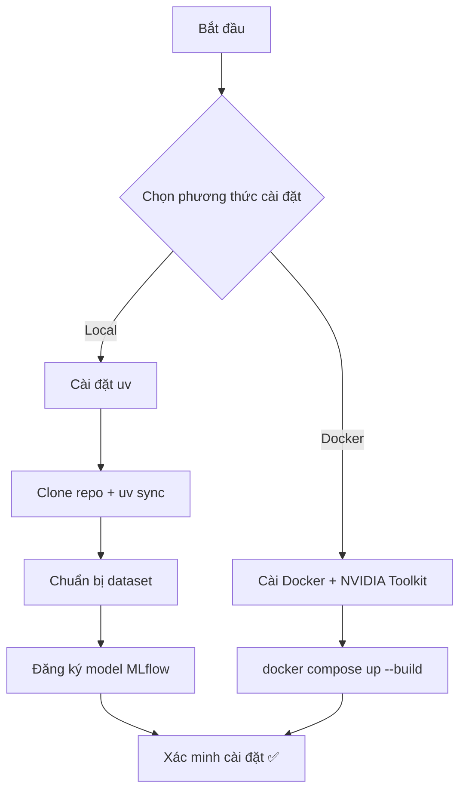

# Hướng Dẫn Cài Đặt

> [!NOTE]
> Tài liệu này hướng dẫn cài đặt dự án **Brain Tumor Detection MLOps** — bao gồm cài đặt môi trường phát triển local và triển khai qua Docker.

---

## 1. Yêu Cầu Hệ Thống

### Phần mềm bắt buộc

| Thành phần | Phiên bản | Ghi chú |
|------------|-----------|---------|
| **Python** | 3.12+ | Bắt buộc |
| **uv** (Astral) | Latest | Package manager thay thế pip |
| **Git** | Latest | Quản lý source code |
| **Docker** + **Docker Compose** | 20.10+ / v2+ | Cho container deployment |
| **NVIDIA GPU** + **CUDA** | CUDA 11.8 | Khuyến nghị, có thể chạy trên CPU |

### Phần cứng

| Tài nguyên | Tối thiểu | Khuyến nghị |
|------------|-----------|-------------|
| **RAM** | 8 GB | 16 GB |
| **Disk** | 10 GB+ | Cho dependencies + model weights |
| **GPU** | — (CPU fallback) | NVIDIA GPU hỗ trợ CUDA 11.8 |

### Hệ điều hành hỗ trợ

- **Windows** 10 / 11
- **Ubuntu** 22.04+
- **macOS** (chỉ hỗ trợ CPU, không có CUDA)

---

## 2. Cài Đặt Môi Trường Phát Triển (Local)

### 2.1. Cài đặt uv

**uv** là package manager hiện đại từ [Astral](https://astral.sh), thay thế `pip` + `venv` với tốc độ nhanh hơn đáng kể.

**Windows (PowerShell):**

```powershell
powershell -c "irm https://astral.sh/uv/install.ps1 | iex"
```

**Linux / macOS:**

```bash
curl -LsSf https://astral.sh/uv/install.sh | sh
```

**Xác minh cài đặt:**

```bash
uv --version
```

> [!TIP]
> Sau khi cài đặt, hãy khởi động lại terminal để `uv` được nhận diện trên `PATH`.

---

### 2.2. Clone project

```bash
git clone https://github.com/your-username/mlops_brain_turmo.git
cd mlops_brain_turmo
```

---

### 2.3. Cài đặt dependencies

```bash
# Tạo virtualenv + cài tất cả dependencies (bao gồm PyTorch CUDA 11.8)
uv sync

# Cài thêm dev dependencies (pytest, jupyter, dvc)
uv sync --group dev
```

> [!IMPORTANT]
> PyTorch với CUDA 11.8 được cấu hình tự động thông qua `[tool.uv.index]` trong `pyproject.toml`.
> `uv` sẽ resolve và tải đúng phiên bản GPU từ PyTorch index — **không cần cài đặt thủ công**.

---

### 2.4. Chuẩn bị dataset

Dataset **Brain Tumor Detection** (YOLO format) bao gồm **4 classes**:

| Class | Mô tả |
|-------|--------|
| `glioma` | U thần kinh đệm |
| `meningioma` | U màng não |
| `notumor` | Không có khối u |
| `pituitary` | U tuyến yên |

**Cấu trúc thư mục dataset:**

```
datasets/
├── train/
│   ├── images/       # Ảnh training (*.jpg, *.png)
│   └── labels/       # Label YOLO format (*.txt)
└── val/
    ├── images/       # Ảnh validation
    └── labels/       # Label validation
```

> [!NOTE]
> Cấu hình đường dẫn dataset nằm trong file `configs/data.yaml`. Hãy kiểm tra và cập nhật đường dẫn phù hợp với máy của bạn trước khi training.

---

### 2.5. Đăng ký model vào MLflow (lần đầu)

```bash
uv run python scripts/migrate_registry.py
```

Script này thực hiện các bước sau:

1. Đọc model weights từ thư mục `deployed_models/v1/` (bao gồm `best.pt` và `best.onnx`)
2. Đăng ký model vào **MLflow Model Registry** dưới dạng **PyFunc wrapper**
3. Gán alias `@production` cho phiên bản model đã đăng ký

> [!TIP]
> Chỉ cần chạy script này **một lần** khi khởi tạo project hoặc khi cần migrate model mới vào registry.

---

## 3. Cài Đặt Qua Docker

### 3.1. Yêu cầu

| Thành phần | Phiên bản | Ghi chú |
|------------|-----------|---------|
| **Docker Engine** | 20.10+ | Bắt buộc |
| **Docker Compose** | v2+ | Bắt buộc |
| **NVIDIA Container Toolkit** | Latest | Cần thiết cho GPU support |

> [!WARNING]
> Nếu không cài đặt **NVIDIA Container Toolkit**, container sẽ không thể truy cập GPU.
> Inference vẫn hoạt động trên CPU nhưng tốc độ sẽ chậm hơn đáng kể.

---

### 3.2. Build và chạy

```bash
# Build cả backend + frontend
docker compose up --build -d

# Xem logs real-time
docker compose logs -f

# Dừng tất cả services
docker compose down
```

**Chi tiết base images:**

| Service | Base Image | Kích thước ước tính |
|---------|-----------|---------------------|
| **Backend** | `nvidia/cuda:11.8.0-runtime-ubuntu22.04` | ~2-3 GB (có GPU passthrough) |
| **Frontend** | `python:3.12-slim` | ~300 MB |

---

### 3.3. Volumes

| Volume | Container Path | Mục đích |
|--------|---------------|----------|
| `./models` | `/app/models` | Training weights |
| `./mlruns` | `/app/mlruns` | MLflow database + artifacts |
| `./deployed_models` | `/app/deployed_models` | Versioned model cache |

> [!IMPORTANT]
> Đảm bảo các thư mục `models/`, `mlruns/`, và `deployed_models/` tồn tại trên host trước khi chạy `docker compose up`. Docker sẽ tạo chúng dưới dạng thư mục rỗng nếu chưa có, nhưng điều này có thể gây lỗi permission trên Linux.

---

## 4. Xác Minh Cài Đặt

### Kiểm tra PyTorch và CUDA

```bash
uv run python -c "import torch; print(f'PyTorch: {torch.__version__}, CUDA: {torch.cuda.is_available()}')"
```

**Kết quả mong đợi:**

```
PyTorch: 2.x.x, CUDA: True
```

> Nếu `CUDA: False`, xem phần [Xử Lý Sự Cố](#5-xử-lý-sự-cố-thường-gặp) bên dưới.

### Chạy test suite

```bash
uv run pytest tests/ -v
```

### Khởi chạy API server

```bash
uv run python -m uvicorn src.servering.api:app --host 127.0.0.1 --port 8000
```

Sau khi server khởi động, truy cập endpoint health check để xác minh:

```
http://localhost:8000/health
```

**Response mong đợi:**

```json
{
  "status": "healthy"
}
```

---

## 5. Xử Lý Sự Cố Thường Gặp

### ❌ CUDA không nhận diện được

| Bước kiểm tra | Lệnh |
|----------------|------|
| Kiểm tra NVIDIA driver | `nvidia-smi` |
| Xác nhận CUDA Toolkit 11.8 đã cài | `nvcc --version` |
| Kiểm tra PyTorch CUDA version | `uv run python -c "import torch; print(torch.version.cuda)"` |

> [!TIP]
> PyTorch CUDA version phải khớp với CUDA Toolkit đã cài trên hệ thống. Nếu `torch.version.cuda` trả về `None`, nghĩa là bạn đang dùng phiên bản CPU-only.

---

### ❌ `uv sync` thất bại

```bash
# Đảm bảo Python 3.12+ đã cài đặt
python --version

# Xóa cache của uv
uv cache clean

# Xóa virtualenv cũ và tạo lại
rm -rf .venv
uv sync
```

> [!NOTE]
> Trên Windows, thay `rm -rf .venv` bằng `Remove-Item -Recurse -Force .venv` trong PowerShell.

---

### ❌ Docker build lỗi

```bash
# Kiểm tra NVIDIA Container Toolkit
nvidia-ctk --version

# Kiểm tra Docker daemon đang chạy
docker info

# Build riêng từng stage để debug
docker build --target backend .
```

> [!CAUTION]
> Nếu build stage `backend` thất bại với lỗi liên quan đến CUDA, hãy đảm bảo host machine có NVIDIA driver tương thích. Container không tự cài driver — nó chỉ sử dụng driver từ host thông qua NVIDIA Container Toolkit.

---

### ❌ MLflow database lỗi

```bash
# Kiểm tra đường dẫn tracking URI
echo $MLFLOW_TRACKING_URI
# Mong đợi: sqlite:///mlruns/mlflow.db

# Đảm bảo thư mục mlruns/ tồn tại
mkdir -p mlruns

# Nếu file mlflow.db bị corrupt, xóa và chạy lại migrate
rm mlruns/mlflow.db
uv run python scripts/migrate_registry.py
```

> [!WARNING]
> Xóa `mlflow.db` sẽ mất toàn bộ lịch sử experiment và model registry. Hãy backup trước khi xóa nếu có dữ liệu quan trọng.

---

## Tham Khảo Nhanh


