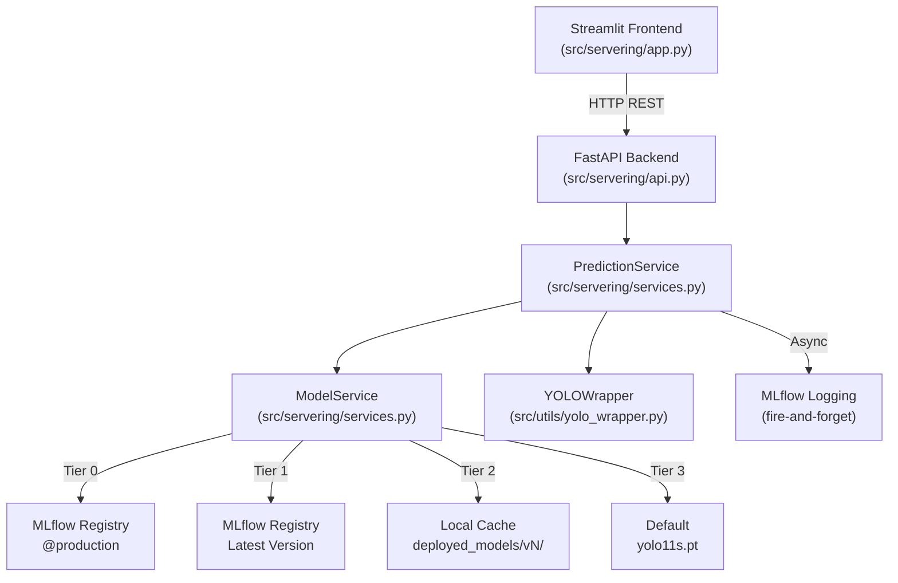
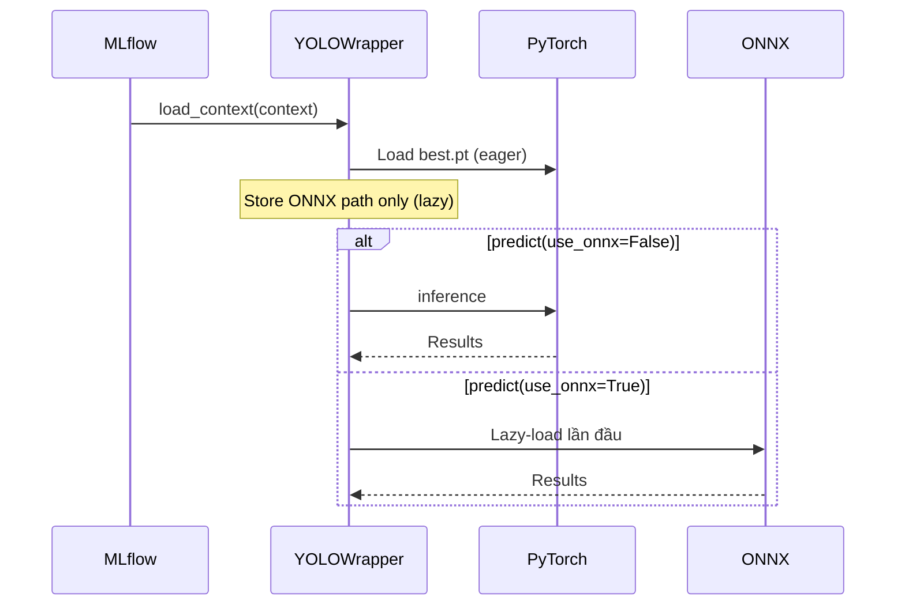
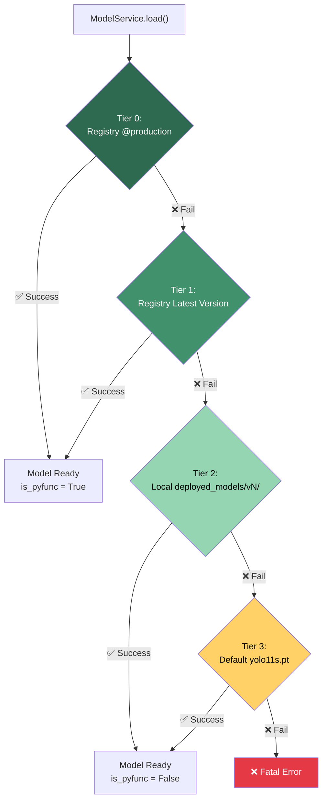
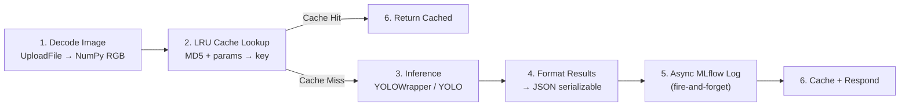
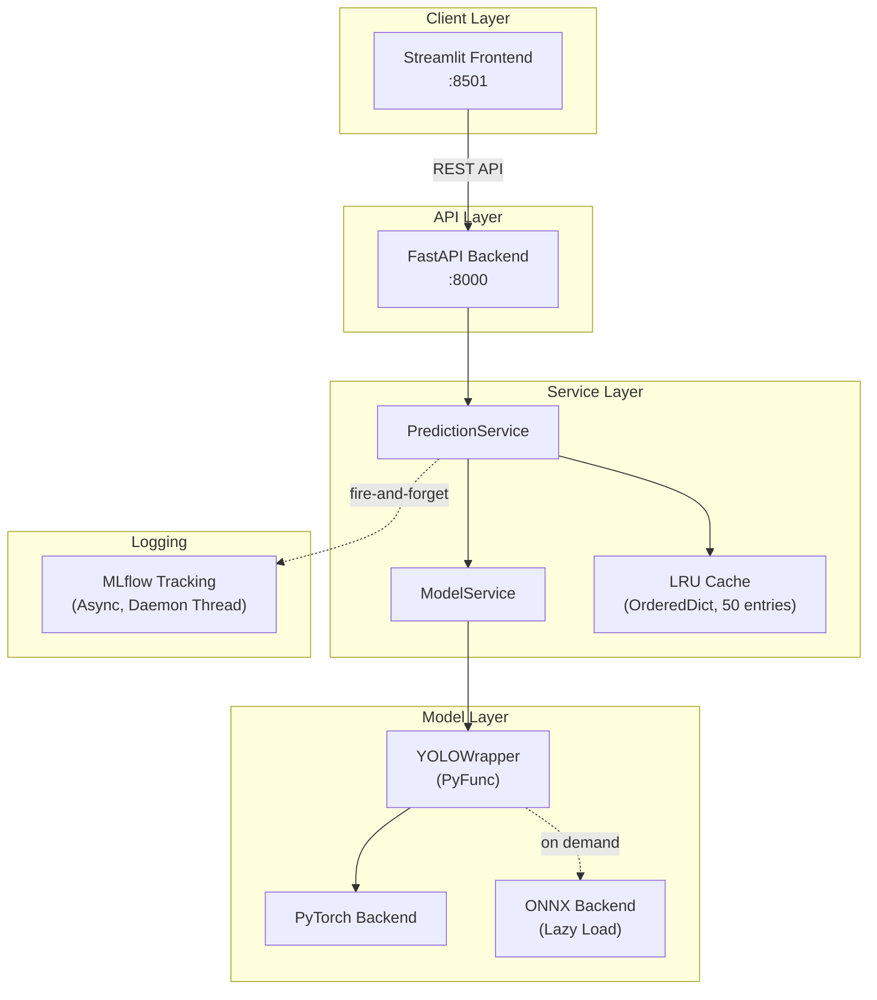

# Model Serving

> [!NOTE]
> Tài liệu này mô tả kiến trúc **Model Serving** của dự án **Brain Tumor Detection** — từ cách model được load, inference pipeline hoạt động, đến cách user tương tác qua Web UI.

---

## Tổng Quan Kiến Trúc Serving

Serving layer được thiết kế theo nguyên tắc **graceful degradation** — hệ thống luôn khởi động được ngay cả khi MLflow registry không khả dụng.



### Các thành phần chính

| Thành phần | File | Vai trò |
|---|---|---|
| **ModelService** | `src/servering/services.py` | Load model với 4-tier fallback |
| **PredictionService** | `src/servering/services.py` | Inference pipeline với LRU caching |
| **YOLOWrapper** | `src/utils/yolo_wrapper.py` | Custom MLflow PyFunc wrapper cho YOLO |
| **FastAPI API** | `src/servering/api.py` | REST endpoints cho inference |
| **Streamlit Frontend** | `src/servering/app.py` | Web UI cho end-user |

---

## YOLOWrapper — Custom PyFunc

`YOLOWrapper` kế thừa `mlflow.pyfunc.PythonModel`, cho phép đóng gói model YOLO vào MLflow ecosystem với hỗ trợ **dual-backend** (PyTorch + ONNX).

### Cơ Chế Hoạt Động



| Method / Property | Mô tả |
|---|---|
| `load_context()` | Được gọi **tự động** khi MLflow load model. Load PyTorch model ngay (primary). Chỉ **store ONNX path** cho lazy loading. |
| `onnx_model` (property) | **Lazy-load** ONNX model khi lần đầu truy cập. Zero extra RAM cho đến khi thực sự cần. |
| `onnx_available` (property) | Check xem ONNX weights có tồn tại trên disk không — **không load** model vào memory. |
| `predict(context, model_input, params)` | Chạy inference qua backend được chọn. |

### Predict Parameters

```python
params = {
    "use_onnx": True,    # False = PyTorch (default), True = ONNX
    "confidence": 0.25   # Confidence threshold cho NMS
}
```

### Artifacts Bundled

Khi log model lên MLflow, hai artifact được đính kèm:

| Artifact Key | File | Bắt buộc |
|---|---|---|
| `best_pt` | PyTorch weights (`.pt`) | ✅ Có |
| `best_onnx` | ONNX weights (`.onnx`) | ❌ Optional |

> [!IMPORTANT]
> **Tại sao không gọi `PyFuncModel.predict()` trực tiếp?**
>
> MLflow `PyFuncModel.predict()` sẽ convert numpy images sang **DataFrame** → cực kỳ chậm và tốn memory với image data. Thay vào đó, ta **extract `YOLOWrapper` instance** trực tiếp:
> ```python
> wrapper = pyfunc_model._model_impl.python_model  # type: YOLOWrapper
> results = wrapper.predict(context=None, model_input=image, params=params)
> ```
> Cách này bypass hoàn toàn DataFrame conversion layer của MLflow.

---

## ModelService — 4-Tier Fallback

`ModelService` đảm bảo API **luôn khởi động được**, bất kể trạng thái của MLflow tracking server hay model registry.



### Chi Tiết Từng Tier

#### Tier 0: Registry `@production` (Primary)

```python
model = mlflow.pyfunc.load_model("models:/brain_tumor_detector@production")
wrapper = model._model_impl.python_model  # Extract YOLOWrapper
```

- **Nguồn**: MLflow Model Registry, alias `@production`
- **Kết quả**: `is_pyfunc = True` → hỗ trợ đầy đủ ONNX switching
- **Khi nào fail**: MLflow server down, chưa có alias `@production`, network lỗi

#### Tier 1: Registry Latest Version (Rollback)

```python
# Scan tất cả versions, thử từ mới nhất → cũ nhất
versions = client.search_model_versions("name='brain_tumor_detector'")
for v in sorted(versions, key=lambda x: int(x.version), reverse=True):
    model = mlflow.pyfunc.load_model(f"models:/brain_tumor_detector/{v.version}")
```

- **Nguồn**: MLflow Model Registry, version cụ thể
- **Kết quả**: `is_pyfunc = True`
- **Khi nào fail**: Không có version nào load được, registry trống

#### Tier 2: Local `deployed_models/vN/` (Offline Cache)

```python
# Tìm thư mục vN/ có số version cao nhất
# Load trực tiếp best.pt qua YOLO()
model = YOLO("deployed_models/v5/best.pt")
```

- **Nguồn**: Thư mục local, được tạo bởi CI/CD pipeline
- **Kết quả**: `is_pyfunc = False` → **không hỗ trợ** ONNX switching
- **Khi nào dùng**: Offline environment, MLflow server không khả dụng

#### Tier 3: Default `yolo11s.pt` (Last Resort)

```python
model = YOLO("yolo11s.pt")  # Pretrained, chưa fine-tune
```

> [!WARNING]
> Model ở Tier 3 là pretrained YOLOv11s **chưa fine-tune** cho brain tumor detection. Kết quả detection sẽ **không chính xác**. Tier này chỉ đảm bảo API không crash khi khởi động.

- **Nguồn**: Ultralytics pretrained weights
- **Kết quả**: `is_pyfunc = False`, model chưa train → kết quả kém
- **Khi nào dùng**: Không có model nào khác, first-time setup

---

## PredictionService — Inference Pipeline

Pipeline xử lý inference qua **6 bước** tuần tự, với LRU caching và async logging.

### Pipeline 6 Bước



#### Bước 1 — Decode Image

```python
# UploadFile → NumPy RGB array
file_bytes = await file.read()
np_array = np.frombuffer(file_bytes, np.uint8)
image = cv2.imdecode(np_array, cv2.IMREAD_COLOR)
image = cv2.cvtColor(image, cv2.COLOR_BGR2RGB)
```

#### Bước 2 — LRU Cache Lookup

Cache key được tạo từ **3 thành phần**:

```python
cache_key = f"{md5(file_bytes)}_{confidence}_{use_onnx}"
```

#### Bước 3 — Inference

```python
if model_service.is_pyfunc:
    # Qua YOLOWrapper — hỗ trợ ONNX switching
    results = wrapper.predict(
        context=None,
        model_input=image,
        params={"use_onnx": use_onnx, "confidence": confidence}
    )
else:
    # Trực tiếp qua YOLO — chỉ PyTorch
    results = model(image, conf=confidence)
```

#### Bước 4 — Format Results

Convert YOLO `Results` object thành JSON serializable list:

```python
[
    {
        "class": "glioma",
        "confidence": 0.92,
        "bbox": [x1, y1, x2, y2]
    }
]
```

#### Bước 5 — Async MLflow Logging

```python
thread = threading.Thread(target=log_to_mlflow, daemon=True)
thread.start()  # Fire-and-forget
```

Metrics được log:

| Metric | Mô tả |
|---|---|
| `request_id` | UUID cho mỗi request |
| `model_type` | `pyfunc` hoặc `direct` |
| `model_framework` | `pytorch` hoặc `onnx` |
| `filename` | Tên file ảnh upload |
| `processing_time` | Thời gian inference (seconds) |
| `num_detections` | Số lượng detections |
| `avg_confidence` | Trung bình confidence score |
| `max_confidence` | Confidence score cao nhất |

> [!TIP]
> Async logging chạy trong **daemon thread** — exception được `catch` và `print`, **không bao giờ** ảnh hưởng đến response trả về client.

#### Bước 6 — Cache + Respond

Kết quả được lưu vào LRU cache trước khi trả về.

### LRU Cache Implementation

Cache sử dụng `collections.OrderedDict` — implementation đơn giản, thread-safe đủ cho single-process serving.

```python
from collections import OrderedDict

class LRUCache:
    MAX_CACHE_SIZE = 50

    def get(self, key):
        if key in self._cache:
            self._cache.move_to_end(key)  # Move to most-recent
            return self._cache[key]
        return None

    def put(self, key, value):
        if len(self._cache) >= self.MAX_CACHE_SIZE:
            self._cache.popitem(last=False)  # Evict least-recent
        self._cache[key] = value
```

| Tham số | Giá trị |
|---|---|
| **Max size** | 50 entries |
| **Eviction policy** | LRU (`popitem(last=False)`) |
| **Cache key** | `MD5(file_bytes)` + `confidence` + `use_onnx` |
| **Hit behavior** | `move_to_end()` — đẩy lên cuối (most recent) |

---

## FastAPI API Endpoints

### Endpoints

| Method | Path | Mô tả |
|---|---|---|
| `GET` | `/health` | Health check — trả về model status |
| `POST` | `/predict` | Inference trên ảnh upload |

### Request / Response

**`POST /predict`**

```
Content-Type: multipart/form-data
```

| Field | Type | Default | Mô tả |
|---|---|---|---|
| `file` | `UploadFile` | — | Ảnh MRI (JPEG/PNG) |
| `confidence` | `float` | `0.25` | Confidence threshold |
| `use_onnx` | `bool` | `False` | Sử dụng ONNX backend |

**Response:**

```json
{
    "request_id": "uuid-string",
    "model_type": "pyfunc",
    "model_framework": "pytorch",
    "processing_time": 0.123,
    "detections": [
        {
            "class": "glioma",
            "confidence": 0.92,
            "bbox": [100, 200, 300, 400]
        }
    ]
}
```

---

## Streamlit Frontend

### Tính Năng

| Tính năng | Chi tiết |
|---|---|
| **Upload ảnh** | Hỗ trợ JPEG, PNG |
| **Sidebar controls** | Confidence slider (0.0–1.0), ONNX toggle, Model status |
| **Hiển thị kết quả** | Original image + Detection results **side-by-side** |
| **Bounding boxes** | Màu theo class (xem bảng bên dưới) |
| **Client-side cache** | LRU cache 20 entries qua `st.session_state` |
| **Image preprocessing** | Resize to 640px max trước khi gửi API |
| **Health check** | Tự động check API health khi load page |

### Bounding Box Color Map

| Class | Màu | Mã |
|---|---|---|
| `glioma` | 🔴 Red | `#FF0000` |
| `meningioma` | 🟢 Green | `#00FF00` |
| `pituitary` | 🔵 Blue | `#0000FF` |
| `notumor` | 🟡 Yellow | `#FFFF00` |

### Cấu Hình

| Biến | Nguồn | Default |
|---|---|---|
| `API_URL` | Environment variable `API_URL` | `http://localhost:8000` |
| `MAX_CACHE_ENTRIES` | Hardcoded | `20` |
| `MAX_IMAGE_SIZE` | Hardcoded | `640` (pixels) |

---

## Chạy Services

### Local Development

```bash
# Backend — FastAPI trên port 8000
uv run python -m uvicorn src.servering.api:app --host 127.0.0.1 --port 8000

# Frontend — Streamlit
uv run python -m streamlit run src/servering/app.py

# MLflow UI — Tracking dashboard
uv run mlflow ui --backend-store-uri sqlite:///mlruns/mlflow.db
```

> [!TIP]
> Chạy **backend trước**, sau đó mới khởi động frontend. Streamlit sẽ tự động health check API khi load — nếu backend chưa sẵn sàng, UI sẽ hiển thị warning.

### Docker

```bash
# Build và chạy tất cả services
docker compose up --build -d
```

> [!NOTE]
> Docker Compose sẽ khởi động cả backend, frontend, và MLflow UI. Xem `docker-compose.yml` để biết chi tiết port mapping và volume mounts.

---

## Tóm Tắt Kiến Trúc



| Đặc tính | Giá trị |
|---|---|
| **Fault tolerance** | 4-tier fallback — luôn có model sẵn sàng |
| **Performance** | LRU cache (server 50 + client 20 entries) |
| **Flexibility** | Dual-backend PyTorch/ONNX switching at runtime |
| **Observability** | Async MLflow logging mỗi request |
| **Graceful degradation** | Tier 3 đảm bảo API không crash |
