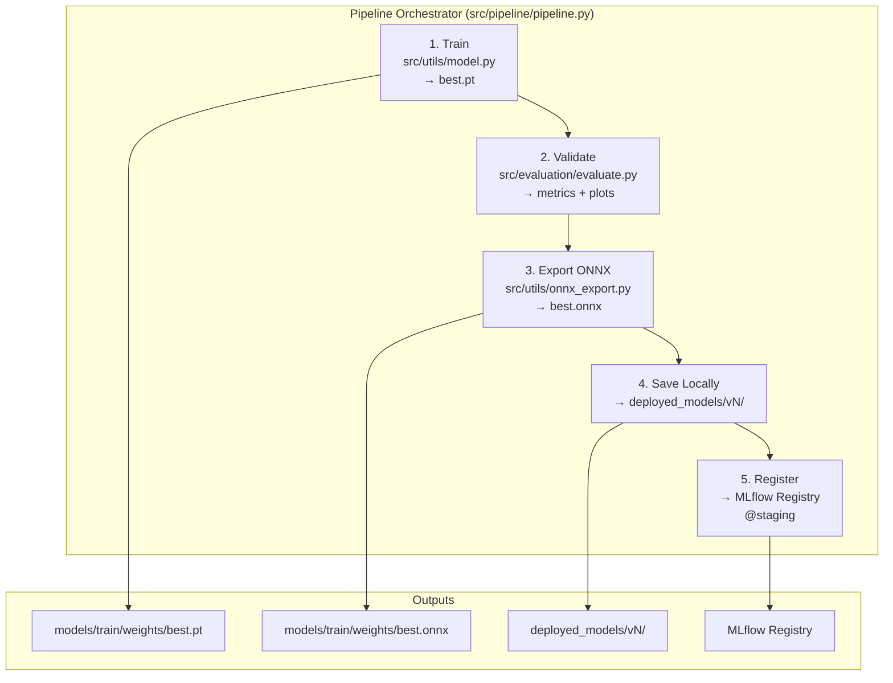

# Pipeline MLOps

> [!NOTE]
> Tài liệu này mô tả chi tiết **Pipeline Orchestrator** — hệ thống điều phối 5 bước tự động hoá quy trình MLOps cho dự án Brain Tumor Detection.

## Tổng Quan

Pipeline orchestrator nằm tại `src/pipeline/pipeline.py`, chạy **5 bước tuần tự**. Mỗi lần chạy pipeline sẽ tạo ra một **phiên bản model mới** được version hoá và đăng ký vào MLflow Model Registry.


| Bước | Tên | Mô tả ngắn |
|------|-----|-------------|
| 1 | **Train** | Huấn luyện model YOLOv11s với MLflow autolog |
| 2 | **Validate** | Đánh giá model trên tập validation |
| 3 | **Export ONNX** | Chuyển đổi model sang định dạng ONNX |
| 4 | **Save Locally** | Lưu phiên bản model vào thư mục local |
| 5 | **Register** | Đăng ký model vào MLflow Model Registry |

---

## Các Bước Pipeline

### Step 1: Train (Huấn luyện)

Bước đầu tiên thực hiện huấn luyện model **YOLOv11s** (Ultralytics) với **MLflow autolog** được bật tự động.

- **Entry point:** `src/utils/model.py` → `train_model()`
- **Output:** `models/train/weights/best.pt`

#### MLflow Integration

MLflow **tự động log** các thông tin sau trong quá trình training:

| Loại | Chi tiết |
|------|----------|
| **Params** | `epochs`, `imgsz`, `batch_size` |
| **Metrics** | `mAP`, `precision`, `recall` |
| **Artifacts** | `best.pt` (model weights tốt nhất) |

#### Tính năng bổ sung

- **Resume training:** Hỗ trợ tiếp tục huấn luyện từ checkpoint trước đó
- **Auto-detect device:** Tự động phát hiện **GPU (CUDA)** nếu có, nếu không sẽ fallback về **CPU**

> [!TIP]
> Sử dụng GPU sẽ tăng tốc quá trình training đáng kể. Đảm bảo CUDA toolkit đã được cài đặt nếu muốn training trên GPU.

---

### Step 2: Validate (Đánh giá)

Bước này đánh giá hiệu năng của model vừa được huấn luyện trên tập dữ liệu validation.

- **Entry point:** `src/evaluation/evaluate.py` → `evaluate_model()`
- **Input:** `best.pt` + `data.yaml`
- **Output:** metrics dict, visualization plots, evaluation report

#### Metrics

| Metric | Mô tả |
|--------|--------|
| `mAP@0.5` | Mean Average Precision tại IoU threshold 0.5 |
| `mAP@0.5:0.95` | Mean Average Precision trung bình từ IoU 0.5 đến 0.95 |
| `precision` | Tỷ lệ dự đoán đúng trên tổng số dự đoán |
| `recall` | Tỷ lệ phát hiện đúng trên tổng số ground truth |

#### Visualizations

Bước validate tự động tạo các biểu đồ trực quan:

- **Precision/Recall bar chart** — So sánh precision và recall theo từng class
- **mAP\@0.5 chart** — Biểu đồ mAP\@0.5 cho từng class

> [!NOTE]
> Tất cả metrics và visualizations được log vào MLflow experiment có tên `model_evaluation`.

---

### Step 3: Export ONNX

Chuyển đổi model PyTorch (`.pt`) sang định dạng **ONNX** (Open Neural Network Exchange) để tối ưu inference.

- **Entry point:** `src/utils/onnx_export.py` → `export_to_onnx()`
- **Input:** `best.pt`
- **Output:** `best.onnx`

#### Export Options

| Option | Default | Mô tả |
|--------|---------|--------|
| `dynamic_axes` | `true` | Cho phép input shape linh hoạt |
| `simplify` | `true` | Đơn giản hoá graph ONNX |
| `opset` | `12` | Phiên bản ONNX opset |

> [!IMPORTANT]
> Định dạng ONNX cho phép **inference nhanh hơn trên CPU** và tương thích với nhiều runtime khác nhau (ONNX Runtime, TensorRT, OpenVINO).

---

### Step 4: Save Locally (Lưu phiên bản)

Bước này tự động **phiên bản hoá** model và lưu vào thư mục local.

- Tự động detect **version number tiếp theo**
- Copy `best.pt` + `best.onnx` → `deployed_models/vN/`
- Phiên bản hoá theo thứ tự tăng dần: `v1`, `v2`, `v3`, ...

#### Cấu trúc thư mục

```
deployed_models/
├── v1/
│   ├── best.pt
│   └── best.onnx
├── v2/
│   ├── best.pt
│   └── best.onnx
└── v3/
    ├── best.pt
    └── best.onnx
```

---

### Step 5: Register (Đăng ký MLflow Registry)

Bước cuối cùng đăng ký model vào **MLflow Model Registry** để quản lý vòng đời model.

#### Chi tiết đăng ký

- Đăng ký cả **PT + ONNX** weights dưới dạng `YOLOWrapper` (`mlflow.pyfunc.PythonModel`)
- Sử dụng `mlflow.pyfunc.log_model()` để wrap model
- Gán alias **`@staging`** cho model mới đăng ký

#### Description

Mỗi model version trong Registry bao gồm description với các thông tin:

- **Version** — Số phiên bản local
- **Epochs** — Số epochs đã train
- **Image size** (`imgsz`) — Kích thước ảnh input
- **Batch size** — Batch size sử dụng khi train
- **mAP scores** — Điểm mAP\@0.5 và mAP\@0.5:0.95
- **Run ID** — MLflow Run ID tương ứng

> [!TIP]
> Có thể **skip bước đăng ký** bằng cách truyền flag `--skip-register` khi chạy pipeline (hữu ích cho lúc thử nghiệm nhanh).

---

## Chạy Pipeline

### CLI Arguments

| Argument | Mô tả | Default |
|----------|--------|---------|
| `--data` | Đường dẫn tới file `data.yaml` | `configs/data.yaml` |
| `--epochs` | Số epochs huấn luyện | `100` |
| `--batch-size` | Batch size | `16` |
| `--img-size` | Kích thước ảnh input (pixel) | `640` |
| `--model-name` | Tên model trong MLflow Registry | `brain_tumor_detector` |
| `--skip-register` | Bỏ qua bước đăng ký MLflow Registry | `false` |

### Ví dụ Sử Dụng

#### Full pipeline

```bash
uv run python -m src.pipeline.pipeline --epochs 100
```

#### Skip registration

```bash
uv run python -m src.pipeline.pipeline --epochs 50 --skip-register
```

#### Custom config đầy đủ

```bash
uv run python -m src.pipeline.pipeline \
    --data configs/data.yaml \
    --epochs 100 \
    --batch-size 16 \
    --img-size 640
```

---

## Promote Model

Sau khi kiểm tra model ở trạng thái **staging**, có thể promote lên **production** bằng script:

```bash
uv run python scripts/migrate_registry.py --promote --version <N>
```

> [!WARNING]
> Hãy đảm bảo đã kiểm tra kỹ model staging (metrics, inference test) trước khi promote lên production. Model production sẽ được sử dụng trực tiếp trong môi trường triển khai.


---

## Pipeline Output

Mỗi lần chạy pipeline thành công, hệ thống sẽ in ra **summary** bao gồm:

| Thông tin | Ví dụ |
|-----------|-------|
| **MLflow Run ID** | `a1b2c3d4e5f6...` |
| **Local Version** | `deployed_models/v3/` |
| **Files** | `best.pt` + `best.onnx` |
| **mAP\@0.5** | `0.8921` |
| **mAP\@0.5:0.95** | `0.7534` |
| **Registry Version** | `Version 3` |
| **Registry Alias** | `@staging` |

---

## Chạy Từng Bước Riêng

Mỗi bước trong pipeline có thể chạy **độc lập** (standalone) phục vụ mục đích debug hoặc thử nghiệm.

### Training standalone

```bash
uv run python src/training/train.py --epochs 50
```

### Evaluation standalone

```bash
uv run python -m src.evaluation.evaluate \
    --model-path models/train/weights/best.pt \
    --data-yaml configs/data.yaml
```

### ONNX export standalone

```bash
uv run python -m src.utils.onnx_export \
    --model models/train/weights/best.pt
```

### Model monitoring

```bash
uv run python -m src.monitoring.monitor_model \
    --model-path models/train/weights/best.pt \
    --test-data path/to/test/images
```

> [!CAUTION]
> Khi chạy từng bước riêng, hãy đảm bảo **thứ tự phụ thuộc** giữa các bước được tuân thủ. Ví dụ: không thể export ONNX nếu chưa có file `best.pt` từ bước training.

---

## Tham Khảo Nhanh


