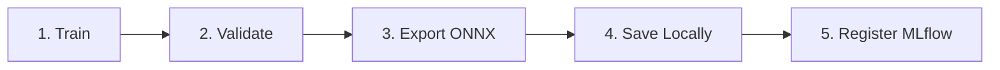
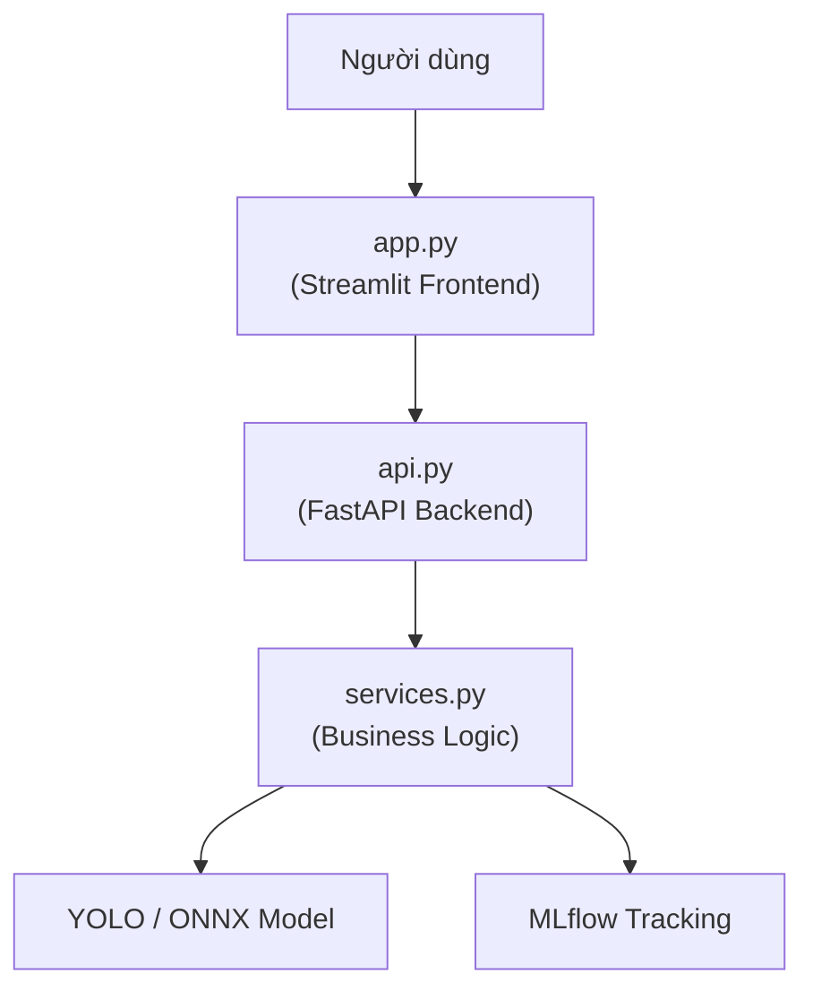
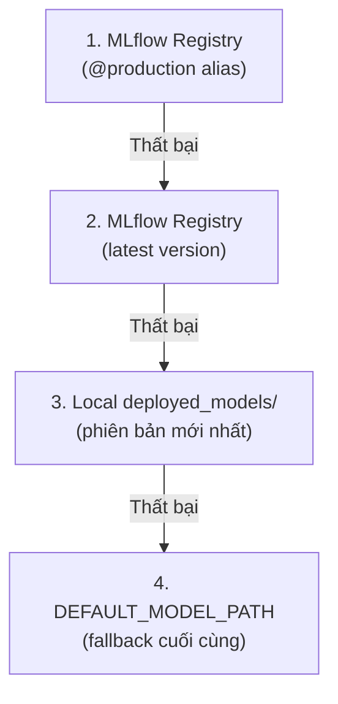
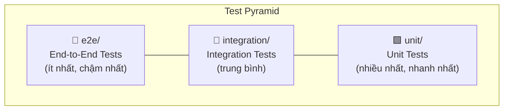
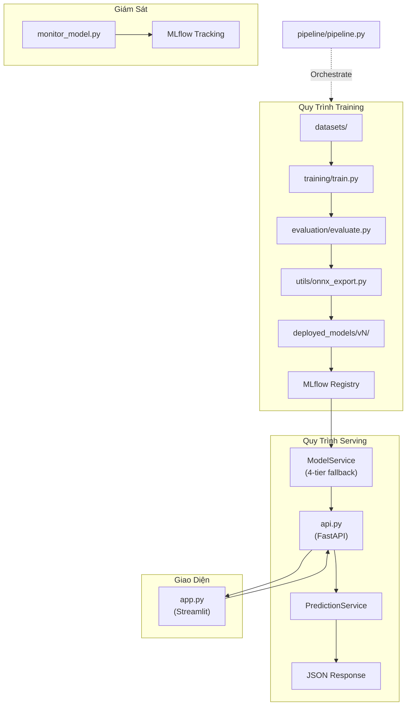

# Cấu Trúc Dự Án — MLOps Brain Tumor Detection

> [!NOTE]
> Tài liệu này mô tả chi tiết cấu trúc thư mục và vai trò của từng module trong dự án **MLOps Brain Tumor Detection**. Mọi thay đổi cấu trúc cần được cập nhật tại đây.

---

## Mục Lục

- [Tổng Quan Cấu Trúc](#tổng-quan-cấu-trúc)
- [Mô Tả Chi Tiết Từng Module](#mô-tả-chi-tiết-từng-module)
  - [src/config.py — Cấu Hình Tập Trung](#srcconfig.py--cấu-hình-tập-trung)
  - [src/pipeline/ — Pipeline Orchestrator](#srcpipeline--pipeline-orchestrator)
  - [src/servering/ — Serving Layer](#srcservering--serving-layer)
  - [src/utils/ — Utilities](#srcutils--utilities)
  - [src/evaluation/ — Đánh Giá Model](#srcevaluation--đánh-giá-model)
  - [src/deployment/ — Triển Khai Model](#srcdeployment--triển-khai-model)
  - [src/monitoring/ — Giám Sát Model](#srcmonitoring--giám-sát-model)
  - [scripts/ — Tiện Ích Dòng Lệnh](#scripts--tiện-ích-dòng-lệnh)
  - [configs/ — Cấu Hình Dataset](#configs--cấu-hình-dataset)
  - [tests/ — Kiểm Thử](#tests--kiểm-thử)
- [Các File Gốc (Root Files)](#các-file-gốc-root-files)
- [Quy Ước Code](#quy-ước-code)
- [Sơ Đồ Luồng Dữ Liệu](#sơ-đồ-luồng-dữ-liệu)

---

## Tổng Quan Cấu Trúc

```
mlops_brain_turmo/
├── configs/                        # Cấu hình dataset
│   ├── data.yaml                   # Training dataset config (4 classes)
│   └── data_test.yaml              # Test dataset config
├── datasets/                       # Image datasets (không track trong git)
├── deployed_models/                # Model cache phiên bản hóa
│   └── v1/
│       ├── best.pt                 # PyTorch weights
│       └── best.onnx               # ONNX weights
├── scripts/
│   └── migrate_registry.py         # Re-register models + promote @production
├── src/
│   ├── __init__.py
│   ├── config.py                   # Cấu hình tập trung
│   ├── pipeline/
│   │   └── pipeline.py             # 5-step MLOps orchestrator
│   ├── servering/
│   │   ├── __init__.py
│   │   ├── api.py                  # FastAPI endpoints
│   │   ├── app.py                  # Streamlit frontend
│   │   └── services.py             # ModelService + PredictionService
│   ├── utils/
│   │   ├── model.py                # YOLO load/train/predict + ONNXModel
│   │   ├── yolo_wrapper.py         # Custom MLflow PyFunc wrapper
│   │   └── onnx_export.py          # ONNX export utility
│   ├── evaluation/
│   │   └── evaluate.py             # Model evaluation + MLflow logging
│   ├── deployment/
│   │   ├── deploy_model.py         # Environment-based deployment
│   │   └── register_model.py       # CLI for registry management
│   ├── monitoring/
│   │   └── monitor_model.py        # Inference monitoring
│   └── training/
│       └── train.py                # CLI training entry point
├── tests/
│   ├── __init__.py
│   ├── conftest.py                 # Test fixtures
│   ├── mocks.py                    # Mock objects
│   ├── unit/                       # Unit tests
│   ├── integration/                # Integration tests
│   └── e2e/                        # End-to-end tests
├── notebooks/                      # Jupyter experiments
├── docs/                           # Documentation
├── Dockerfile                      # Multi-stage Docker build
├── docker-compose.yml              # Service orchestration
├── .dockerignore                   # Docker build context exclusions
├── .gitignore                      # Git exclusions
├── pyproject.toml                  # Dependencies + uv config
├── uv.lock                         # Lock file
├── MLproject                       # MLflow project entry points
├── python_env.yaml                 # Python environment spec
├── LICENSE                         # MIT License
└── README.md                       # Project overview
```

---

## Mô Tả Chi Tiết Từng Module

### `src/config.py` — Cấu Hình Tập Trung

> [!IMPORTANT]
> Đây là **single source of truth** cho toàn bộ constants trong dự án. **Không bao giờ hardcode** URIs, paths, hoặc tên model ở bất kỳ module nào khác.

File này chứa tất cả cấu hình tập trung, bao gồm:

| Constant | Mô Tả | Ví Dụ |
|---|---|---|
| `MLFLOW_TRACKING_URI` | Đường dẫn SQLite database cho MLflow tracking | `sqlite:///mlflow.db` |
| `MLFLOW_REGISTRY_MODEL` | Tên model đăng ký trong MLflow Registry | `"brain_tumor_detector"` |
| `MLFLOW_EXPERIMENT_*` | Tên experiment cho từng workflow (train, eval, deploy...) | `"Training"`, `"Evaluation"` |
| `CLASS_NAMES` | Mapping class index → tên class | `{0: "glioma", 1: "meningioma", 2: "notumor", 3: "pituitary"}` |
| `DEFAULT_MODEL_PATH` | Đường dẫn mặc định tới model weights | `"deployed_models/v1/best.pt"` |
| `DEPLOYED_DIR` | Thư mục chứa các phiên bản model đã deploy | `"deployed_models/"` |
| `DEFAULT_CONFIDENCE` | Ngưỡng confidence mặc định cho inference | `0.25` |
| `INPUT_SIZE` | Kích thước ảnh đầu vào cho model | `640` |
| `API_HOST` / `API_PORT` | Host và port cho FastAPI server | `"0.0.0.0"` / `8000` |
| `PREDICTION_CACHE_SIZE` | Số lượng prediction tối đa lưu trong cache | `50` |

**Quy ước sử dụng:**

```python
# ✅ Đúng — Import từ config
from src.config import MLFLOW_TRACKING_URI, CLASS_NAMES

# ❌ Sai — Hardcode giá trị
tracking_uri = "sqlite:///mlflow.db"  # KHÔNG LÀM THẾ NÀY
```

---

### `src/pipeline/` — Pipeline Orchestrator

#### `pipeline.py` — 5-Step MLOps Pipeline

Pipeline tự động hóa toàn bộ quy trình MLOps theo **5 bước tuần tự**:



| Bước | Mô Tả |
|---|---|
| **Train** | Huấn luyện model YOLO với cấu hình từ `configs/data.yaml` |
| **Validate** | Chạy validation trên tập val, tính metrics (mAP, precision, recall) |
| **Export ONNX** | Chuyển đổi PyTorch weights sang định dạng ONNX |
| **Save Locally** | Lưu weights (`.pt` + `.onnx`) vào `deployed_models/vN/` |
| **Register MLflow** | Đăng ký model mới vào MLflow Registry |

**Các function chính:**

- `_next_version_number()` — Tự động xác định số phiên bản tiếp theo dựa trên thư mục `deployed_models/`
- `save_version_locally()` — Copy weights vào thư mục phiên bản mới
- `register_version()` — Đăng ký model vào MLflow Registry với PyFunc wrapper
- `run_pipeline()` — Orchestrate toàn bộ 5 bước

**Chạy pipeline:**

```bash
python -m src.pipeline.pipeline --epochs 100
```

---

### `src/servering/` — Serving Layer

Serving layer bao gồm 3 thành phần chính phục vụ inference và giao diện người dùng:



#### `api.py` — FastAPI Backend

Cung cấp **6 REST endpoints**:

| Endpoint | Method | Mô Tả |
|---|---|---|
| `/` | GET | Health check cơ bản |
| `/health` | GET | Chi tiết trạng thái hệ thống |
| `/metrics` | GET | Prometheus-compatible metrics |
| `/model-info` | GET | Thông tin model đang loaded |
| `/predict` | POST | Nhận ảnh MRI, trả kết quả detection |
| `/mlflow-dashboard` | GET | Redirect tới MLflow UI |

**Đặc điểm kỹ thuật:**
- **Startup event**: Load model một lần duy nhất khi khởi động qua `ModelService`
- **CORS middleware**: Cho phép all origins (phù hợp môi trường development)
- **Error handling**: Trả về structured error response với HTTP status codes phù hợp

#### `app.py` — Streamlit Frontend

Giao diện web cho phép người dùng upload ảnh MRI và xem kết quả detection.

**Tính năng chính:**
- **Upload ảnh**: Hỗ trợ định dạng JPG, PNG, JPEG
- **Sidebar controls**:
  - Confidence threshold slider (điều chỉnh ngưỡng tin cậy)
  - ONNX toggle (chuyển đổi giữa PyTorch và ONNX inference)
  - Model status indicator (hiển thị trạng thái model)
- **Client-side LRU cache**: 20 entries qua `st.session_state`, giảm redundant API calls

#### `services.py` — Business Logic

Chứa 2 service classes chính:

**`ModelService`** — Quản lý model loading với **4-tier fallback**:



**`PredictionService`** — Pipeline xử lý inference:

1. **Decode** — Giải mã ảnh từ request
2. **Cache check** — Kiểm tra prediction cache (tránh tính toán lại)
3. **Infer** — Chạy inference qua model
4. **Async log** — Ghi log bất đồng bộ vào MLflow
5. **Respond** — Trả kết quả cho client

---

### `src/utils/` — Utilities

#### `model.py` — YOLO Utilities

Cung cấp các function cốt lõi cho model operations:

| Function / Class | Mô Tả |
|---|---|
| `load_model()` | Load model từ file `.pt` hoặc `.onnx`, tự động detect format |
| `train_model()` | Huấn luyện YOLO với MLflow autolog tích hợp |
| `predict()` | Chạy inference trên ảnh đầu vào |
| `ONNXModel` class | Full ONNX Runtime wrapper bao gồm preprocessing, postprocessing, NMS |

**`ONNXModel` class** xử lý hoàn chỉnh:
- **Preprocessing**: Resize, normalize, transpose (HWC → CHW)
- **Inference**: Chạy qua ONNX Runtime session
- **Postprocessing**: Decode output tensors, áp dụng confidence threshold
- **NMS (Non-Maximum Suppression)**: Loại bỏ bounding boxes trùng lặp

#### `yolo_wrapper.py` — MLflow PyFunc Wrapper

```python
class YOLOWrapper(mlflow.pyfunc.PythonModel):
    """
    Custom wrapper cho phép MLflow quản lý cả PT và ONNX weights.
    - Bundle cả 2 định dạng weights trong cùng một artifact
    - Lazy-load ONNX model khi cần (tiết kiệm memory)
    - Tương thích hoàn toàn với MLflow Model Registry
    """
```

> [!TIP]
> `YOLOWrapper` cho phép đăng ký một model duy nhất trong MLflow Registry mà vẫn hỗ trợ cả PyTorch và ONNX inference, tùy thuộc vào môi trường deploy.

#### `onnx_export.py` — ONNX Export

- `export_to_onnx()` — Wrapper quanh Ultralytics export, chuyển đổi `.pt` → `.onnx`
- Hỗ trợ cấu hình `opset_version`, `dynamic_axes`, `simplify`

---

### `src/evaluation/` — Đánh Giá Model

#### `evaluate.py`

Function `evaluate_model()` thực hiện:

1. **Chạy YOLO validation** trên tập dữ liệu validation
2. **Tính toán metrics**: mAP@50, mAP@50-95, precision, recall, F1-score
3. **Tạo visualizations**: Confusion matrix, P-R curve, F1 curve
4. **Log kết quả vào MLflow**: Metrics, artifacts (plots), và parameters

| Metric | Mô Tả |
|---|---|
| `mAP@50` | Mean Average Precision tại IoU threshold 0.50 |
| `mAP@50-95` | Mean Average Precision trung bình từ IoU 0.50 đến 0.95 |
| `precision` | Tỷ lệ dự đoán đúng trong tất cả dự đoán positive |
| `recall` | Tỷ lệ phát hiện đúng trong tất cả ground truth positive |

---

### `src/deployment/` — Triển Khai Model

#### `deploy_model.py` — Environment-Based Deployment

Triển khai model từ MLflow Registry với quản lý cấu hình theo môi trường:
- Tải model version được chỉ định (hoặc `@production` alias)
- Copy weights vào `deployed_models/`
- Cập nhật cấu hình deployment

#### `register_model.py` — CLI Registry Management

Công cụ dòng lệnh cho quản lý MLflow Model Registry:

```bash
# Đăng ký model mới
python -m src.deployment.register_model register --run-id <RUN_ID>

# Liệt kê tất cả versions
python -m src.deployment.register_model list

# Chuyển stage (sử dụng aliases)
python -m src.deployment.register_model promote --version 3 --alias production

# Xem chi tiết model
python -m src.deployment.register_model details --version 3
```

---

### `src/monitoring/` — Giám Sát Model

#### `monitor_model.py`

Function `monitor_model()` thực hiện giám sát inference trên tập ảnh test:

| Metric Giám Sát | Mô Tả |
|---|---|
| **Avg Confidence** | Độ tin cậy trung bình của tất cả predictions |
| **Detection Rate** | Tỷ lệ ảnh có ít nhất 1 detection |
| **Processing Time** | Thời gian xử lý trung bình mỗi ảnh (ms) |
| **Class Distribution** | Phân bố số lượng detection theo từng class |

Tất cả metrics được log vào MLflow experiment riêng biệt để theo dõi theo thời gian.

---

### `scripts/` — Tiện Ích Dòng Lệnh

#### `migrate_registry.py`

Script migration phục vụ khi cần:
- **Re-register** các model weights cục bộ trong `deployed_models/vN/` thành PyFunc wrapper trong MLflow Registry
- **Promote** version mới nhất lên `@production` alias

> [!WARNING]
> Chỉ chạy script này khi cần migration (ví dụ: sau khi xóa/reset MLflow database). Trong quy trình bình thường, pipeline sẽ tự động xử lý registration.

```bash
python scripts/migrate_registry.py
```

---

### `configs/` — Cấu Hình Dataset

#### `data.yaml` — Training Dataset Config

```yaml
# Cấu trúc cơ bản
train: ../datasets/train/images
val: ../datasets/val/images

nc: 4  # Số lượng classes

names:
  0: glioma
  1: meningioma
  2: notumor
  3: pituitary
```

#### `data_test.yaml` — Test Dataset Config

Cấu hình tương tự nhưng trỏ tới tập test, sử dụng cho evaluation và monitoring.

---

### `tests/` — Kiểm Thử

Hệ thống test được **phân tầng** theo 3 cấp độ:



| Thành Phần | Mô Tả |
|---|---|
| `conftest.py` | Shared test fixtures (model instances, sample data, temp directories) |
| `mocks.py` | Mock objects cho external dependencies (MLflow, ONNX Runtime) |
| `unit/` | Test từng function/class độc lập, không cần external services |
| `integration/` | Test tương tác giữa các module (ví dụ: service + model loading) |
| `e2e/` | Test toàn bộ workflow (ví dụ: upload ảnh → nhận kết quả detection) |

---

## Các File Gốc (Root Files)

| File | Mô Tả |
|---|---|
| `Dockerfile` | **Multi-stage build**: Stage 1 (builder) cài dependencies, Stage 2 (runtime) chỉ copy artifacts cần thiết → giảm image size |
| `docker-compose.yml` | Orchestrate các services: API server, Streamlit app, MLflow server |
| `.dockerignore` | Loại bỏ `datasets/`, `notebooks/`, `.git/` khỏi Docker build context |
| `.gitignore` | Loại bỏ `datasets/`, `deployed_models/`, `mlruns/`, `__pycache__/` khỏi Git |
| `pyproject.toml` | Khai báo dependencies, project metadata, và cấu hình `uv` package manager |
| `uv.lock` | Lock file đảm bảo reproducible builds (tương đương `poetry.lock`) |
| `MLproject` | Định nghĩa MLflow entry points: `train`, `evaluate`, `deploy`, `pipeline` |
| `python_env.yaml` | Spec môi trường Python cho MLflow reproducibility |
| `LICENSE` | Giấy phép MIT License |
| `README.md` | Tổng quan dự án, hướng dẫn cài đặt và sử dụng |

---

## Quy Ước Code

> [!IMPORTANT]
> Tất cả contributors cần tuân thủ các quy ước sau để đảm bảo tính nhất quán của codebase.

### 1. Cấu Hình (Configuration)

```python
# ✅ Tất cả constants PHẢI được định nghĩa trong src/config.py
from src.config import MLFLOW_TRACKING_URI, DEFAULT_CONFIDENCE

# ❌ KHÔNG hardcode values
uri = "sqlite:///mlflow.db"  # SAI
```

### 2. Model Loading

```python
# ✅ Luôn sử dụng ModelService để load model
from src.servering.services import ModelService
model = ModelService.get_model()

# ❌ KHÔNG load model trực tiếp
from ultralytics import YOLO
model = YOLO("best.pt")  # SAI — bypass fallback logic
```

### 3. MLflow Registry APIs

```python
# ✅ Sử dụng aliases (chuẩn mới)
client.get_model_version_by_alias("brain_tumor_detector", "production")

# ❌ KHÔNG sử dụng deprecated stages
client.transition_model_version_stage(...)  # DEPRECATED
```

### 4. Model Registration

```python
# ✅ Sử dụng mlflow.pyfunc.log_model() với YOLOWrapper
mlflow.pyfunc.log_model(
    artifact_path="model",
    python_model=YOLOWrapper(),
    artifacts={"pt_path": "best.pt", "onnx_path": "best.onnx"}
)

# ❌ KHÔNG log model trực tiếp không qua wrapper
mlflow.pytorch.log_model(model, "model")  # SAI — thiếu ONNX support
```

---

## Sơ Đồ Luồng Dữ Liệu



---

> [!NOTE]
> Tài liệu này được cập nhật lần cuối vào **23/06/2026**. Nếu cấu trúc dự án thay đổi, vui lòng cập nhật tài liệu tương ứng.
